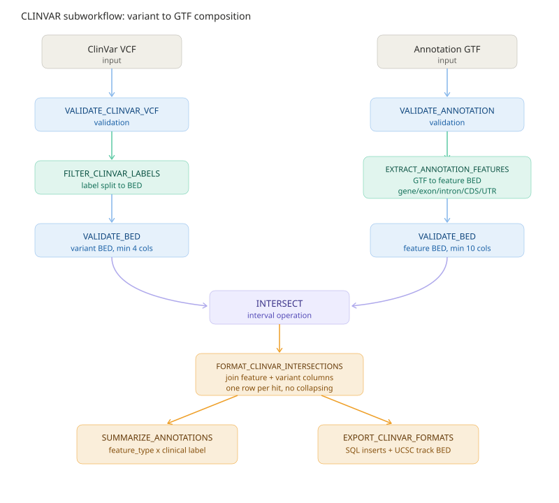

# lncbookv3-processing Nextflow pipeline

This project now uses Nextflow DSL2 with an nf-core-inspired layout:

- `main.nf`: top-level entry point.
- `nextflow.config`: profiles and default parameters.
- `modules/local/<tool>/main.nf`: one reusable process per local tool.
- `modules/local/<tool>/meta.yml`: short module metadata.
- `modules/local/<tool>/environment.yml`: conda environment for the process.
- `subworkflows/local/<branch>/main.nf`: reusable branch workflows composed from modules.
- `tests/data`: small smoke-test fixtures migrated from the previous workflow layout.

## Branches

The reference branch always runs and validates the annotation before extracting reusable BED features. Optional branches are controlled with `params.run_*` flags:

- `run_clinvar`: takes the ClinVar VCF **and** the annotation file (`--annotation`, GTF/GFF3/BED auto-detected); validates both, extracts gene / transcript / exon / intron / CDS / 5'UTR / 3'UTR intervals, keeps the definite clinical-significance labels, intersects variants with features, then annotates, summarises and exports (see [The CLINVAR subworkflow](#the-clinvar-subworkflow-variant-gtf)).
- `run_cosmic`: same composition as CLINVAR for the COSMIC TSV — validation, FATHMM-MKL pathogenic filtering, intersection against the `--annotation` features (GTF/GFF3/BED auto-detected), annotation, summary, export, plus `pipeline_run.log` and the Markdown/HTML debug report. Outputs are `cosmic_annotations.tsv/.sql`, `cosmic_ucsc.bed`, `cosmic_summary.tsv`.
- `run_gwas_catalog`: same composition as CLINVAR for the GWAS Catalog TSV — validation, genome-wide-significance filtering, intersection against the `--annotation` features, annotation, summary, export, plus `pipeline_run.log` and the Markdown/HTML debug report. Outputs are `gwas_annotations.tsv/.sql`, `gwas_ucsc.bed`, `gwas_summary.tsv`.
- `run_smprot`: same composition as CLINVAR for the SmProt TSV — validation, record filtering, intersection against the `--annotation` features (GTF/GFF3/BED auto-detected), annotation with a transcript mapping report, summary, export, plus `pipeline_run.log` and the Markdown/HTML debug report. Outputs are `smprot_annotations.tsv/.sql`, `smprot_ucsc.bed`, `smprot_mapping_report.tsv`, `smprot_summary.tsv`.
- `run_methylation`: JSON-manifest-driven methylation analysis; the run report is wrapped with `PIPELINE_REPORTS` (`pipeline_run.log` + Markdown/HTML debug report).
- `run_cerna`: JSON-manifest-driven ceRNA integration.
- `run_conservation`: JSON-manifest-driven lncRNA conservation analysis; the run report is wrapped with `PIPELINE_REPORTS` (`pipeline_run.log` + Markdown/HTML debug report).

## Annotation feature intervals (gene / exon / intron / CDS / UTR)

`EXTRACT_ANNOTATION_FEATURES` converts a GTF/GFF3 into a 10-column BED-like table
(`chrom, start, end, feature_type, feature_id, gene_id, transcript_id, strand, gene_type, transcript_type`).
The `--feature` token list selects what is emitted:

| Token | Emitted `feature_type` | Source |
| --- | --- | --- |
| `gene` | `gene` | `gene` rows |
| `transcript` | `transcript` | `transcript` / `mRNA` / `lnc_RNA` rows |
| `exon` | `exon` | `exon` rows |
| `intron` | `intron` | derived from consecutive exons of a transcript |
| `cds` | `CDS` | `CDS` rows |
| `utr` | `5UTR` + `3UTR` | explicit GENCODE-style `UTR` / `five_prime_utr` / `three_prime_utr` rows, else derived from exon minus CDS |

`utr5` / `utr3` select a single UTR end. Because a UTR is defined relative to
the CDS, transcripts without a CDS (e.g. most lncRNAs) have no UTR rows. On the
`-` strand the 5'/3' assignment of UTR segments is inverted with respect to the
coordinates.

`--feature` accepts both `--feature gene exon` and repeated
`--feature gene --feature exon`; the CLI uses `argparse` `action="extend"` so
repeated flags accumulate instead of overwriting each other.

## The CLINVAR subworkflow (variant → annotation)

`CLINVAR` takes two channels — the ClinVar VCF and the annotation file — and
composes validation and format conversion around a single interval operation.
The annotation may be **GTF, GFF3 or BED** (`--annotation`); `ANNOTATION_FEATURES`
detects the format from the file extension and dispatches to the right chain:

- `*.gtf[.gz]` / `*.gff[3][.gz]` → `VALIDATE_ANNOTATION` → `EXTRACT_ANNOTATION_FEATURES` → `VALIDATE_BED`
- anything else (treated as BED) → `VALIDATE_BED` (≥3 cols) → `BED_TO_FEATURES` → `VALIDATE_BED` (10 cols)

`BED_TO_FEATURES` normalizes an arbitrary BED into the same 10-column schema:
the name column becomes the `feature_type` when it is a recognised feature
token (`exon`, `CDS`, `5UTR`, `five_prime_utr`, ...), otherwise the row is typed
`interval` and the name becomes the `feature_id`; gene/transcript fields are
filled with `NA`.



| Step | Module | Role |
| --- | --- | --- |
| annotation validation | `VALIDATE_ANNOTATION` (gtf/gff3 branch) | GTF/GFF3 structure, 9 columns, feature attribute checks |
| annotation conversion | `EXTRACT_ANNOTATION_FEATURES` (gtf/gff3 branch) | GTF/GFF3 → feature BED (incl. CDS / 5'UTR / 3'UTR) |
| input BED validation | `VALIDATE_BED` (bed branch, ≥3 cols) | integer coordinates, `end > start` |
| BED normalization | `BED_TO_FEATURES` (bed branch) | BED → 10-column feature schema |
| feature validation | `VALIDATE_BED` | ≥10 columns on the feature table |
| variant validation | `VALIDATE_CLINVAR_VCF` | VCF structure and INFO checks |
| label split | `FILTER_CLINVAR_LABELS` | keep definite labels; emit BED (labels kept inline) + VCF + report |
| variant validation | `VALIDATE_BED` | ≥4 columns on the variant BED |
| interval operation | `INTERSECT` | `bedtools intersect -wa -wb`, one row per overlapping feature |
| annotation format | `FORMAT_CLINVAR_INTERSECTIONS` | join feature and variant columns into one table |
| summary | `SUMMARIZE_ANNOTATIONS` | counts per `feature_type` × clinical label |
| export | `EXPORT_CLINVAR_FORMATS` | SQL inserts + UCSC track BED |
| run log | `PIPELINE_REPORTS` → `AGGREGATE_PIPELINE_LOGS` | concatenate every step report into `pipeline_run.log` |
| debug report | `PIPELINE_REPORTS` → `DEBUG_REPORT` | Markdown + HTML report of all steps, errors first |

`AGGREGATE_PIPELINE_LOGS` gives each run a single intermediate log file: one
`===== <report name> =====` section per step, in report-name order, so a run
can be audited from one file instead of digging through work directories.

For debugging, `DEBUG_REPORT` (`modules/local/debug_report`, script
`scripts/variant_pipeline/generate_debug_report.py`) turns the same reports
into `pipeline_debug_report.md` and `pipeline_debug_report.html`:

- **Overview table** — every step with record count, `error_count` /
  `warning_count` and an `OK` / `WARN` / `FAIL` status;
- **Errors & Warnings** — every non-zero `error*` / `warning*` metric with the
  offending line numbers and messages; failing steps are listed first;
- **Step details** — each report rendered as a table (metric/value reports as
  key-value tables, summaries and annotation tables as row tables, truncated
  at 50 rows).

The HTML variant is self-contained (inline CSS, status badges, no external
dependencies) and both outputs are deterministic (no timestamps), so re-runs
do not break Nextflow caching.

The two steps are not wired by hand in each branch — the shared subworkflow
`subworkflows/local/pipeline_reports` (`PIPELINE_REPORTS`) takes the mixed
report channel, an optional data-table channel (`Channel.empty()` when none)
and a branch id + title, and emits `pipeline_log`, `debug_report_md` and
`debug_report_html`. It drops the per-branch meta ids before aggregation (the
annotation-side and record-side reports carry different basenames), sorts the
reports by file name for stable log sections, and merges the data tables into
the debug report. Every analysis branch uses it: the four variant branches
(clinvar, cosmic, gwas, smprot) pass their annotation table as the data
channel, and the manifest-driven `methylation` / `conservation` branches wrap
their single report through it (`cerna` emits no report file and is not
wrapped).

Every overlapping feature is kept (no collapsing), so a variant that sits in a
CDS is reported once per matching `exon` **and** `CDS` row — the location class
is carried by `feature_type` in the output table.

Recognised clinical-significance labels (`CLNSIG`): `Pathogenic`, `Benign`,
`Drug response`, `Protective`, `Risk factor`, `Affects` (plus `Likely_pathogenic`
etc., which contain a recognised substring). Records whose `CLNSIG` carries none
of these (e.g. `Uncertain_significance`) are dropped by `FILTER_CLINVAR_LABELS`.

### Four implementation traps fixed here

- **Validator output must not reuse the input file name.** Nextflow materialises
  task inputs as symlinks, so declaring `VALIDATE_BED(..., 'gtf_features.bed', ...)`
  while the upstream task also produces `gtf_features.bed` makes the validator
  `open(output, "w")` follow the symlink and truncate the upstream task's own
  output before reading it — the feature table silently came out empty. All six
  `VALIDATE_BED` call sites now write `validated_*.bed`, and
  `genomic_intervals.bed.validate_bed` additionally stages to a temp file and
  `os.replace`s it, so an input/output name clash can no longer destroy data.
- **`argparse` `nargs='+'` overwrites on repetition.** The module expands a
  feature list into repeated `--feature X --feature Y` flags, which left only the
  last token in effect. The CLI now uses `action="extend"`, so both spaced and
  repeated forms accumulate.
- **Don't chain operators on `PROC.out.*` / `WORKFLOW.out.*`, and don't reference
  an emit that does not exist.** `VALIDATE_ANNOTATION.out.report.mix(...)`
  failed to resolve ("Missing process or function mix"), and referencing
  `EXTRACT_ANNOTATION_FEATURES.out.report` (an emit the module never declares)
  surfaced only as a cryptic "evaluating property 'report' for java.util.ArrayList"
  while finalizing the upstream task. Assign each `.out.*` to a local variable
  before applying operators, and keep every referenced emit declared.
- **Reports carry per-source meta ids; don't `groupTuple` across sides.** The
  annotation-side reports are tagged with the annotation file's basename while
  the variant-side reports carry the VCF basename; grouping by meta splits one
  run into several partial logs. The run-log aggregation flattens the mix to
  plain paths and collects them into one list.

## Examples

Run the reference branch only:

```bash
nextflow run . --gtf data/LncBook_v3_hg38.lncRNAs_attr_normalized.gtf
```

Run the bundled smoke profile:

```bash
nextflow run . -profile test,conda
```

Run with Docker containers where available:

```bash
nextflow run . -profile docker --gtf data/LncBook_v3_hg38.lncRNAs_attr_normalized.gtf
```

## Single-module reuse

Every module can be imported from another DSL2 workflow, for example:

```nextflow
include { VALIDATE_BED } from './modules/local/validate_bed/main'

workflow {
    bed_ch = Channel.of(tuple([id: 'example'], file('tests/data/inputs/sample.bed')))
    VALIDATE_BED(bed_ch, 3, 'validated.bed', 'validate_bed_report.tsv')
}
```

BEDOPS converters are available as local modules (`gtf2bed`, `gff2bed`, `vcf2bed`, `sam2bed`, `bam2bed`, `psl2bed`, `rmsk2bed`, `wig2bed`) and use the BioContainers BEDOPS image or the module conda environment. Kent-based converters (chain/PSL, genePred, GFF3, bigWig) are also local modules, using the `lncbookv3-kent:latest` container; see the converter section below.

## Format conversions and validations via nf-core modules

Standard format conversions and validations use nf-core modules vendored under `modules/nf-core/` (copied from [nf-core/modules](https://github.com/nf-core/modules), MIT licence; `main.nf`, `environment.yml` and `meta.yml` only). Each module reads extra tool arguments from `task.ext.args` and the output prefix from `task.ext.prefix`. 44 modules are vendored, pinned to nf-core/modules commit [`0befdd9`](https://github.com/nf-core/modules/commit/0befdd9db2975ee04a97decc1672a4304387e9a7).

The packed converter modules (`bed_to_bigbed` and `bedgraph_to_bigwig`) are gone: `bedToBigBed` and `bedGraphToBigWig` expect records grouped per chromosome with ascending starts (`bedGraphToBigWig` offers no `-sort` flag), so sort first with `bedtools/sort` and pass the same `chrom.sizes` to the converter:

```nextflow
include { BEDTOOLS_SORT }          from './modules/nf-core/bedtools/sort/main'
include { UCSC_BEDTOBIGBED }       from './modules/nf-core/ucsc/bedtobigbed/main'
include { UCSC_BEDGRAPHTOBIGWIG }  from './modules/nf-core/ucsc/bedgraphtobigwig/main'
include { AGAT_CONVERTBED2GFF }    from './modules/nf-core/agat/convertbed2gff/main'

workflow {
    bed_ch      = Channel.of(tuple([id: 'sample'], file('tests/data/inputs/sample.bed')))
    bedgraph_ch = Channel.of(tuple([id: 'sample'], file('tests/data/inputs/sample.bedgraph')))
    chrom_sizes = file('tests/data/inputs/chrom.sizes')

    BEDTOOLS_SORT(bed_ch, chrom_sizes)
    UCSC_BEDTOBIGBED(BEDTOOLS_SORT.out.sorted, chrom_sizes, [])

    BEDTOOLS_SORT(bedgraph_ch, chrom_sizes)
    UCSC_BEDGRAPHTOBIGWIG(BEDTOOLS_SORT.out.sorted, chrom_sizes)

    AGAT_CONVERTBED2GFF(bed_ch)
}
```

Set module arguments in the pipeline config (or per include site):

```nextflow
process {
    withName: 'UCSC_BEDTOBIGBED'    { ext.args = '-type=bed6' }  // optional: standard BED3-BED12 layouts are auto-detected; -type is only needed for non-standard bedPlus layouts
    withName: 'AGAT_CONVERTBED2GFF' { ext.args = '--source lncbookv3 --primary_tag lncRNA' }
}
```

Tool behaviour verified against the kent v482 BioContainers images shipped with the modules:

- `bedToBigBed` auto-detects standard BED3-BED12 field counts; its own `-sort` flag also works, and the chromosome order in the input does not have to match `chrom.sizes`. Pre-sorting with `BEDTOOLS_SORT` is still preferred so the sorted channel can be reused by other steps.
- `bedGraphToBigWig` in v482 has neither a `-clip` nor a `-sort` option: coordinates that overrun `chrom.sizes` fail the task, so clip upstream if needed.

The former custom conversion modules were replaced as follows:

| Former local module | nf-core modules now used |
| --- | --- |
| `bed_to_bigbed` (sorting, BED type inference, report) | `bedtools/sort` then `ucsc/bedtobigbed` |
| `bedgraph_to_bigwig` (sorting, `--clip`, report) | `bedtools/sort` then `ucsc/bedgraphtobigwig` (kent v482 has no `-clip`; clip upstream instead) |
| `bed_to_gff3` | `agat/convertbed2gff` |
| `convert_annotation_format` | `agat/convertspgxf2gxf` (to GFF3) / `agat/convertspgff2gtf` (to GTF) |
| `convert_alignment_format` | `samtools/view` (plus `samtools/sort`, `samtools/index`) |

### Conversion and validation module library

Annotation and interval conversions:

| Module | Direction |
| --- | --- |
| `bedops/gtf2bed` | GTF → BED |
| `bedops/convert2bed` | BAM/GFF/GTF/GVF/PSL → BED (input format inferred from the file extension) |
| `agat/convertgff2bed` | GFF3 → BED12 |
| `ucsc/gtftogenepred` | GTF → genePred; with `ext.args = '-genePredExt -geneNameAsName2'` a refFlat file is produced as well |
| `gffread` | validate, filter and convert GFF/GTF; select the output with `ext.args` (`-T` → GTF, `--bed` → BED, `-w`/`-x`/`-y` → FASTA, default GFF3) |

Coverage tracks (alignment/intervals → bedGraph, bigWig, BED):

| Module | Direction |
| --- | --- |
| `ucsc/wigtobigwig` | WIG → bigWig (needs `chrom.sizes`) |
| `ucsc/bedclip` | clip bedGraph records that overrun `chrom.sizes` (typically before `ucsc/bedgraphtobigwig`) |
| `bedtools/genomecov` | BAM or BED intervals → coverage bedGraph (`-bg`), histogram or per-base reports, with optional built-in sort |
| `deeptools/bamcoverage` | BAM (+ index, optional FASTA and blacklist) → bigWig, or bedGraph with `--outFileFormat bedgraph` |
| `bedtools/bamtobed` | BAM → BED12 |
| `modkit/bedmethyltobigwig` | bedMethyl (ONT modkit) → bigWig (needs `chrom.sizes`) |

VCF/BCF conversions:

| Module | Direction |
| --- | --- |
| `bcftools/view` | subset/filter VCF/BCF by regions, targets or samples; output type via `ext.args` (`-Oz`, `-Ob`, ...) |
| `bcftools/query` | extract VCF/BCF fields into a table (`-f` format string via `ext.args`, file suffix via `ext.suffix`, default `txt`) |
| `bedgovcf` | BED + YAML config + FASTA index → bgzipped VCF |
| `gvcftools/extractvariants` | extract variants in a region list from a VCF/BCF |

Liftover, compression and indexing:

| Module | Direction |
| --- | --- |
| `ucsc/liftover` | BED + chain file → lifted and unlifted BED |
| `picard/liftovervcf` | VCF + chain + reference FASTA → lifted VCF |
| `htslib/bgziptabix` | bgzip (or decompress) a file and optionally build a tabix/CSI index |
| `tabix/bgzip` | bgzip compression with optional tabix index |

Generic format validation (complements the data-specific `validate_*` local modules used by the pipeline branches):

| Module | Checks |
| --- | --- |
| `gt/gff3validator` | strict GFF3 validation (GenomeTools); emits a `*.success.log` or `*.error.log` |
| `htsnimtools/vcfcheck` | a VCF against a background VCF (e.g. gnomAD) → TSV report |
| `samtools/quickcheck` | BAM/CRAM header and EOF integrity; the task fails on corrupt files |

Validate a GFF3 file with the bundled fixture:

```nextflow
include { GT_GFF3VALIDATOR } from './modules/nf-core/gt/gff3validator/main'

workflow {
    gff3_ch = Channel.of(tuple([id: 'sample'], file('tests/data/inputs/sample.gff3')))
    GT_GFF3VALIDATOR(gff3_ch)
}
```

### Cross-assembly and multi-species liftover

Cross-assembly liftover is available in three flavours:

- `ucsc/liftover` (vendored nf-core module): one BED file plus one chain file per task (`liftOver` under the hood, kent v482 container).
- `modules/local/liftover`: wraps `scripts/format_convert/liftover.py`. In addition to the vendored module it emits the unmapped BED, exposes `--min-match` (default `0.95`) and writes a mapping-rate report (`input_records`, `mapped_records`, `unmapped_records`, `mapping_rate`). Runs in the kent container (`container_kent`).
- `modules/local/liftover_multi`: wraps `scripts/format_convert/liftover_multi.py`, a JSON-manifest driver for many species/assemblies in one task. The manifest registers chain files per `(species, from, to)` and lists datasets referencing them; see [scripts/format_convert/liftover.example.json](../scripts/format_convert/liftover.example.json).

Manifest layout:

```json
{
  "min_match": 0.95,
  "chains": [
    {"species": "human", "from": "hg19", "to": "hg38", "chain": "chains/hg19ToHg38.over.chain.gz"},
    {"species": "mouse", "from": "mm39", "to": "mm10", "chain": "chains/mm39ToMm10.over.chain.gz"}
  ],
  "datasets": [
    {"name": "human_lncrna", "species": "human", "from": "hg19", "to": "hg38", "input": "human/lncrna.bed"},
    {"name": "mouse_other", "species": "mouse", "from": "mm39", "to": "mm10", "input": "mouse/other.bed", "chain": "chains/custom.chain.gz", "min_match": 0.9}
  ]
}
```

Datasets may override the global `min_match` and point at a dataset-specific `chain`; otherwise the chain registry is looked up by `(species, from, to)`. Relative `input`/`chain` paths are resolved against `--data-root`. Each dataset produces `<name>.lifted.bed` and `<name>.unmapped.bed` under `--output-dir` (`liftover_outputs`), and the summary `liftover_report.tsv` records `dataset, species, from, to, chain, status, input_records, mapped_records, unmapped_records, mapping_rate, message`. A failing dataset is recorded and does not abort the remaining ones, but the task exits non-zero if any dataset failed.

### Local format validators

Formats without an nf-core validation module are covered by local modules that wrap `scripts/format_convert/validate_*.py` (Python standard library only, except `validate_psl`, which additionally drives the kent `pslCheck` binary; each validator writes a `metric`/`value` TSV report and copies the input through unchanged):

| Module | Checks |
| --- | --- |
| `validate_bigtrack` | bigWig/bigBed via kent `bigWigInfo`/`bigBedInfo` (`version`, `chromCount`, `basesCovered`, item statistics); runs in the kent container |
| `validate_bedgraph` | 4 columns, integer ranges with `start < end`, finite values, ordering warnings |
| `validate_wig` | `fixedStep`/`variableStep` state machine, implicit positions, 1-based ordinates, ordering warnings |
| `validate_genepred` | genePred vs refFlat auto-detection, exon count/list consistency, exon and CDS bounds |
| `validate_sam` | headers (@HD first, @SQ SN/LN), 11 mandatory fields, CIGAR/SEQ/QUAL consistency, optional tag syntax — no samtools needed |
| `validate_chain` | chain header fields, strand/size checks, block accounting against target/query spans, size-only terminator |
| `validate_fasta` | IUPAC alphabet (warnings for other characters), duplicate headers, empty sequences, length statistics |
| `validate_psl` | psLayout header block, 21-field PSL and 23-field psLx layouts, integer and comma-terminated list fields, strand alphabet, coordinate bounds, block ordering, `matches+misMatches+repMatches+nCount` against the block size, Q/T gap bases and gap counts derived from the block layout — then the kent `pslCheck` binary as a second opinion |
| `validate_rmsk` | RepeatMasker `.out`/`.cat`: title header, 14/15-field summary records (optional strand column), percentage columns, 1-based coordinate bounds, `(N)` remaining-base accounting, `qEnd + (left)` constant per query, record ID monotonicity, per-query ordering and overlap, `-a` continuation lines against their summary record, `*` terminator |
| `validate_chrom_sizes` | two tab-separated columns, positive integer sizes, unique names, `.fai`-shaped lines (suggests `cut -f1,2`), canonical chromosome order, mixed `chr` prefixes, UCSC 255-character name limit |
| `validate_bedmethyl` | modkit 18-column and ENCODE 11-column layouts, strand and modification-code syntax (single letter, ChEBI id or `code,motif,offset`), RGB color fields, `Nvalid_cov = Nmod + Nother_mod + Ncanonical`, percent consistency, score/coverage and duplicate-position warnings, ordering warnings |
| `validate_maf` | TCGA MAF comment lines and header row, required core columns versus warned expected columns, 1-based coordinates with `Start_Position <= End_Position`, variant class/type vocabularies, variant-type allele length rules, barcode checks, duplicate mutation records |
| `validate_plink` | PLINK 1.x `.map`/`.ped` pair: 3/4-column map, chromosome codes, duplicate variant ids and marker order; `.ped` token count against `6 + 2 × variants`, sex and phenotype codes, allele alphabet, duplicate samples |

`validate_chain` is also useful as a pre-flight check before `liftover`/`liftover_multi` runs, and `validate_bedgraph`/`validate_wig` before `bedGraphToBigWig`/`wigToBigWig`. `validate_bedmethyl` guards bedMethyl before `bedmethyl_to_bed`, `validate_maf` checks `vcf2maf` / `last/mafconvert` output, and `validate_plink` checks the `.map`/`.ped` pair produced by `plink/vcf`.

`validate_psl` and `validate_chrom_sizes` are complementary: pass the sizes file to `pslCheck` via `--target-sizes` and it additionally asserts that every target name exists, that the `tSize` in the PSL matches the sizes file and that the target coordinates fall inside it. `validate_chrom_sizes` also guards `bedGraphToBigWig`, `wigToBigWig` and `bedToBigBed`, all of which fail obscurely on a malformed `chrom.sizes`.

`validate_psl` runs the stdlib structural pass first and only then calls `pslCheck`, because `pslLoad` aborts on a record whose block list length disagrees with `blockCount`; the report records `pslcheck_skipped_reason` when the call is suppressed. Pass `--skip-pslcheck` (or set no kent on `PATH`) to run the structural pass alone in the plain Python container. The kent image built from the `Dockerfile` already ships `pslCheck`.

### Not available as nf-core modules

The nf-core/modules catalogue (checked at commit `0befdd9`) has no modules for these conversions and checks; keep using the kent binaries or the remaining local modules:

- bigWig → bedGraph/text and bigBed → BED: keep using the local `bigtrack_to_text` module (`bigWigToBedGraph` / `bigBedToBed`).
- Generic BED, GTF and annotation validators: the local `validate_bed`, `validate_gtf` and `validate_annotation` modules keep that role; bedGraph, WIG, genePred/refFlat, SAM, chain, FASTA, bigWig/bigBed, PSL, RepeatMasker `.out`, `chrom.sizes`, bedMethyl, MAF and PLINK `.map`/`.ped` pairs have their own local validators (`validate_bedgraph`, `validate_wig`, `validate_genepred`, `validate_sam`, `validate_chain`, `validate_fasta`, `validate_bigtrack`, `validate_psl`, `validate_rmsk`, `validate_chrom_sizes`, `validate_bedmethyl`, `validate_maf`, `validate_plink`).
- PSL: the nf-core catalogue has **no PSL module at all** (no entry matching `psl` in the module tree), so `bedops/convert2bed -i psl` is the only upstream PSL reader and it converts rather than validates. `validate_psl` therefore drives the kent `pslCheck` binary, which is the authoritative PSL validator (`-noCountCheck`, `-prot`, `-skipInsertCounts`, `-targetSizes` and `-querySizes` are all passable through `ext.args`).
- RepeatMasker: upstream ships `repeatmasker/repeatmasker` (runs the tool) and `repeatmasker/rmouttogff3` (`.out` → GFF3), but neither validates the annotation, so `validate_rmsk` is local. If a stronger structural check is ever wanted, `repeatmasker/rmouttogff3` can be run as a secondary parser since it fails on a malformed `.out`.
- `chrom.sizes`: no nf-core validator exists. The producer is `samtools/faidx`, which absorbed chromosome sizes and superseded the now-deprecated `custom/getchromsizes`; the consumers are `ucsc/bedgraphtobigwig`, `ucsc/wigtobigwig`, `ucsc/bedtobigbed`, `bedtools/sort` and kent `liftOver`. `validate_chrom_sizes` covers that gap.
- BED → GATK interval_list: `gatk4/bedtointervallist`, `gatk4/intervallisttobed` and `picard/bedtointervallist` exist upstream but are GATK-specific; vendor them only if the pipeline adopts GATK tooling.

Liftover and compression are now vendored (`ucsc/liftover`, `picard/liftovervcf`, `htslib/bgziptabix`, `tabix/bgzip`). Related nf-core modules that remain unvendored because they are tool-specific variants or other storage formats: `tabix/tabix` and `samtools/bgzip` (superseded by `htslib/bgziptabix` for compress-and-index); `ea-utils/gtf2bed`, `gtfsort`, `gffcompare`; `biscuit/vcf2bed`, `svtk/vcf2bed` (tool-specific VCF → BED); `plink2/vcf2bgen`, `vcf2db`, `vcf2zarr`, `bio2zarr/vcf2zarrconvert` (VCF → other storage/report formats).

### Local kent converter modules

The nf-core catalogue has **no chain or PSL modules** (0 entries) and no genePred→GTF/BED or bigWig→WIG converter. These local modules wrap the corresponding kent binaries via the `lncbookv3-kent:latest` container. All are standalone (not wired into `main.nf`); import them individually.

| Module | Tool | Direction |
| --- | --- | --- |
| `chain_to_psl` | `chainToPsl` | chain → PSL (needs target/query sequences for match/mismatch counts) |
| `psl_to_chain` | `pslToChain` | PSL → chain |
| `psl_to_bed` | `pslToBed` | PSL → BED (one interval per block) |
| `psl_sort` | `pslSort` | merge + sort PSL files (two-pass; needs temp dir) |
| `psl_reps` | `pslReps` | best alignment per query from sorted PSL (emits PSL + PSR report) |
| `psl_stats` | `pslStats` | per-alignment and aggregate statistics for PSL |
| `chain_sort` | `chainSort` | sort chain by target coordinates |
| `chain_filter` | `chainFilter` | filter chains by score/strand/coordinates (stdout output, options via `ext.args`) |
| `chain_swap` | `chainSwap` | swap query/target sides of chains |
| `chain_merge_sort` | `chainMergeSort` | merge + sort multiple chain files (stdout output) |
| `gene_pred_to_gtf` | `genePredToGtf` | genePred/refFlat → GTF (pass `source='file'` to skip DB lookup) |
| `gene_pred_to_bed` | `genePredToBed` | genePred/refFlat → BED (one interval per exon) |
| `gff3_to_genepred` | `gff3ToGenePred` | GFF3 → genePred |
| `bed_to_genepred` | `bedToGenePred` | BED12 → genePred |
| `bigwig_to_wig` | `bigWigToWig` | bigWig → WIG/bedGraph |
| `bedmethyl_to_bed` | Python (stdlib) | bedMethyl (modkit) → BED6 (strips methylation columns; `--with-coverage`/`--with-percent` append extra fields) |

### Local BED → X converters

The BED → X direction was previously thin (only `bed_to_genepred`, `agat/convertbed2gff`, `ucsc/bedtobigbed`, `bedgovcf`, `bedtools/genomecov` and `ucsc/liftover`). Four new modules close the remaining gaps. All are standalone (not wired into `main.nf`).

| Module | Tool | Direction |
| --- | --- | --- |
| `bed_to_gtf` | Python (stdlib) | BED3-BED6 → GTF (one `exon` feature per interval; 0-based→1-based start; BED name used as gene_id + transcript_id; `ext.source` and `ext.feature` configurable) |
| `bed_to_bed12` | Python (stdlib) | BED3-BED6 → BED12 (single-exon expansion; thickStart=start, blockCount=1, blockSizes=<len>, blockStarts=0; `ext.rgb` configurable) |
| `bed_to_psl` | Python (stdlib) | BED → PSL (100% identity, single block; qSize=interval length; tSize from `--target-sizes` or max end per chrom; psLayout version 3 header prepended) |
| `bed_to_bedgraph` | bedtools genomecov | BED → sorted bedGraph (`-bg` + built-in `sort -k1,1 -k2,2n`; `ext.scale` and `ext.args` pass-through) |

### BED → bigWig subworkflow

The `bed_to_bigwig` subworkflow chains `bed_to_bedgraph` → `ucsc/bedgraphtobigwig` in one call, producing a bigWig coverage track from BED intervals:

```nextflow
include { BED_TO_BIGWIG } from './subworkflows/local/bed_to_bigwig/main'

workflow {
    bed_ch = Channel.of(tuple([id: 'sample'], file('input.bed')))
    sizes  = file('chrom.sizes')
    BED_TO_BIGWIG(bed_ch, sizes)
    // emits: bigwig, bedgraph
}
```

### Newly vendored nf-core converter modules

Thirteen converter modules were added to close the remaining gaps:

| Module | Tool | Purpose |
| --- | --- | --- |
| `modkit/pileup` | modkit | BAM → bedMethyl (fills the missing producer for the methylation chain) |
| `deeptools/bigwigcompare` | deepTools | compare two bigWig tracks → bigWig/bedGraph |
| `deeptools/multibigwigsummary` | deepTools | per-region summary across many bigWigs → table |
| `bedtools/unionbedg` | BEDTools | merge multiple bedGraphs into one multi-column file |
| `samtools/depth` | samtools | per-position depth from BAM |
| `samtools/bedcov` | samtools | per-region read count from BAM |
| `repeatmasker/rmouttogff3` | RepeatMasker | `.out` → GFF3 (complements the existing `rmsk2bed` → BED route) |
| `agat/convertspgff2tsv` | AGAT | GFF/GTF → TSV feature table |
| `agat/spkeeplongestisoform` | AGAT | keep longest transcript per gene |
| `agat/spmergeannotations` | AGAT | merge multiple annotation files |
| `plink/vcf` | PLINK | VCF ↔ PLINK ped/map |
| `vcf2maf` | vcf2maf | VCF → MAF (Mutation Annotation Format) |
| `last/mafconvert` | LAST | MAF → SAM/BED/chain/PSL/Axt |

### Previously identified gaps now closed

The "Known conversion gaps" section previously listed three one-way links. As of this update all three are resolved:

- **Annotation reverse direction**: `gene_pred_to_gtf`, `gene_pred_to_bed`, `gff3_to_genepred`, `bed_to_genepred` are now available as local kent modules. `repeatmasker/rmouttogff3` adds the `.out` → GFF3 route.
- **Methylation chain**: `modkit/pileup` (vendored) is now the bedMethyl producer; `bedmethyl_to_bed` (local Python) strips to standard BED6; `bigwig_to_wig` (local kent) reverses the bigWig conversion.
- **chain / PSL ecosystem**: 10 local kent modules cover conversion (`chain_to_psl`, `psl_to_chain`), analysis (`psl_stats`, `psl_reps`), sorting/filtering (`psl_sort`, `chain_sort`, `chain_filter`, `chain_merge_sort`, `chain_swap`), and extraction (`psl_to_bed`). The nf-core catalogue still has 0 chain and 0 PSL modules; these are all kent-only.
- **BED → X direction**: `bed_to_gtf` (BED→GTF), `bed_to_bed12` (BED→BED12), `bed_to_psl` (BED→PSL) are now available as local Python modules; `bed_to_bigwig` subworkflow chains `bed_to_bedgraph` → `ucsc/bedgraphtobigwig`. Combined with the existing `bed_to_genepred`, `agat/convertbed2gff`, `ucsc/bedtobigbed`, `bedgovcf`, `bedtools/genomecov` and `ucsc/liftover`, the BED → X direction now covers genePred, GFF, GTF, BED12, PSL, bigBed, bigWig, VCF, bedGraph and lifted BED.

The only remaining gap is the **FASTA/FASTQ family** (sequences, FASTA→.fai, FASTA→2bit, BAM→FASTQ), which is intentionally not covered by this project's scope.
